# Run A Python Script On AWS Forever (For Free)
Run a Python script on an EC2 instance (on AWS) forever, for FREE!

  

## Step 1: Have your code
* Have some Python code that can run all the time (in a `while true:` loop or otherwise)
  * Note: this can also work with code that needs to be re-run all the time, but will not work with code that should only be run once a day, or once every `x` hours. That code should be moved to a scheduler script, and that's the script that should be used here.
  * This project will use [The Math DiscordBot](https://github.com/JacobNoahGlik/MathDiscordBot) as an example.

 

## Step 2: Create a free AWS account
* Go to [sign up for AWS](https://portal.aws.amazon.com/billing/signup?nc2=h_ct&src=header_signup&redirect_url=https%3A%2F%2Faws.amazon.com%2Fregistration-confirmation#/start/email) and create your free account
  * You must enter your email twice on the `aws create account website` and confirm it by typing in the verification number sent to your inbox. Create a strong password and attach a payment method.
  * Note: you may need to attach a credit card to this account, and a $1 hold may be placed on the account for 3 business days to make sure AWS can charge you in case you start using paid services. But as long as you use free services (as outlined in this readme), you will not be charged.
  * 

  
Screenshots of every step (when creating your free AWS account) outlined above

  
10 instructions on how to sign up for a free AWS account

  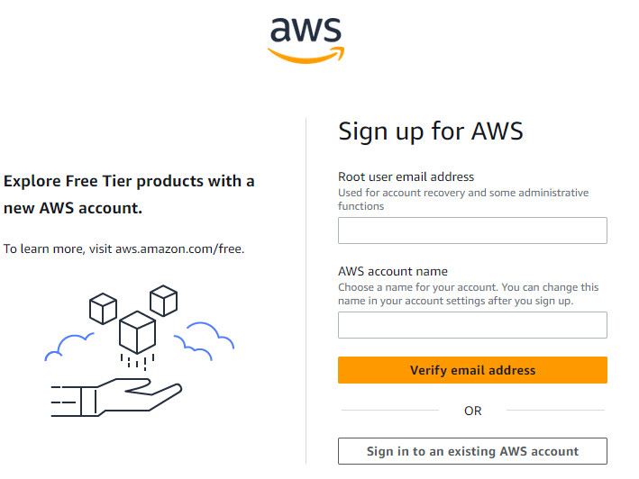
  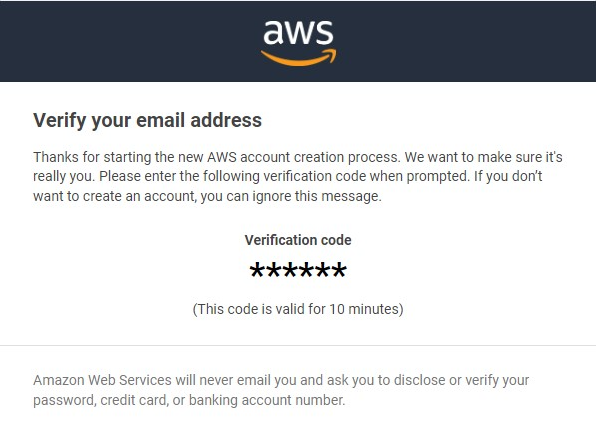
  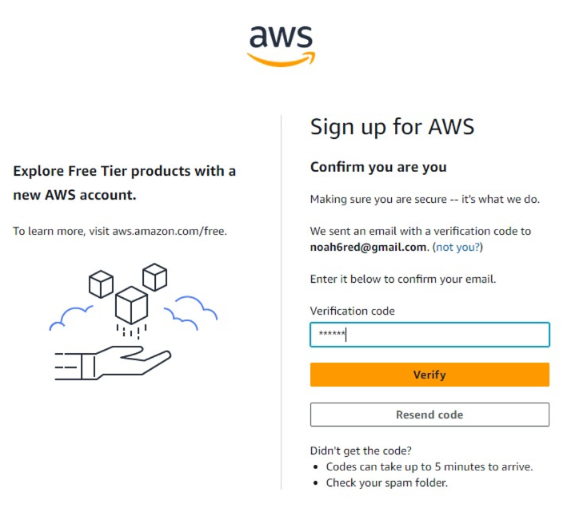
  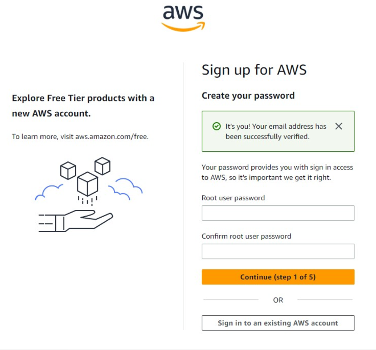
  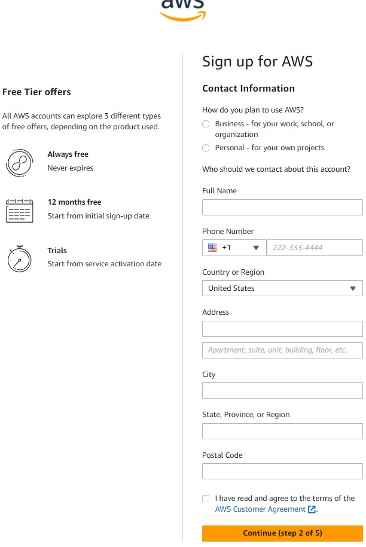
  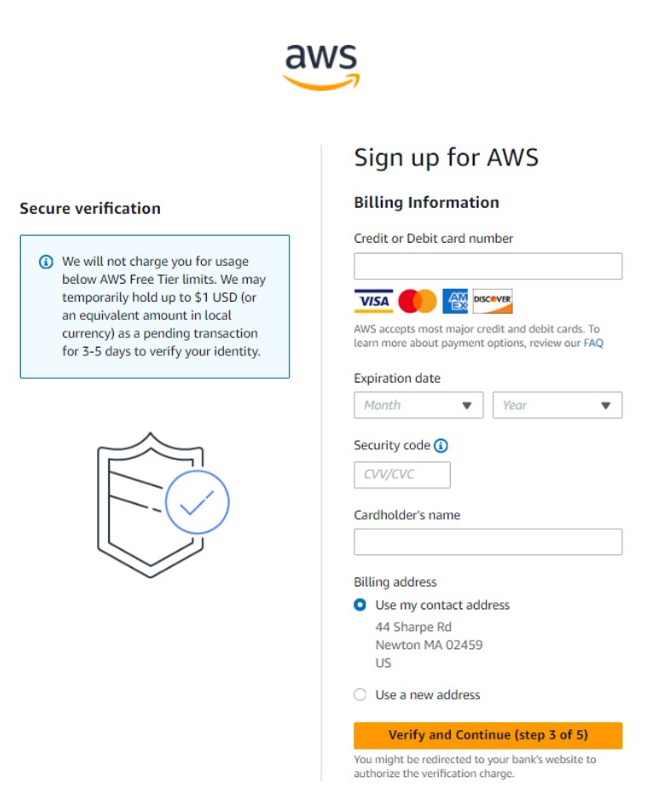
  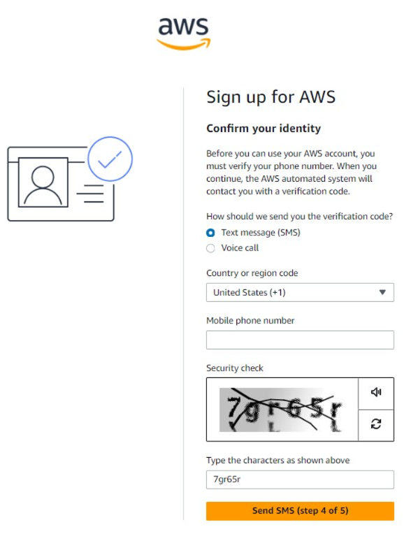
  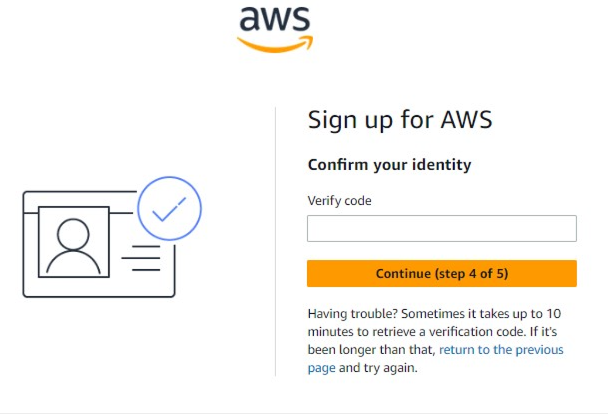
  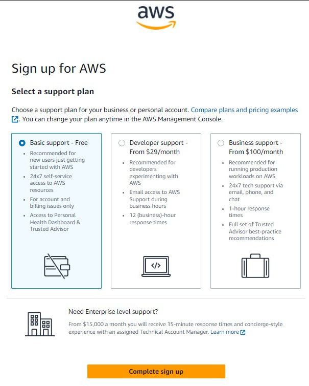
  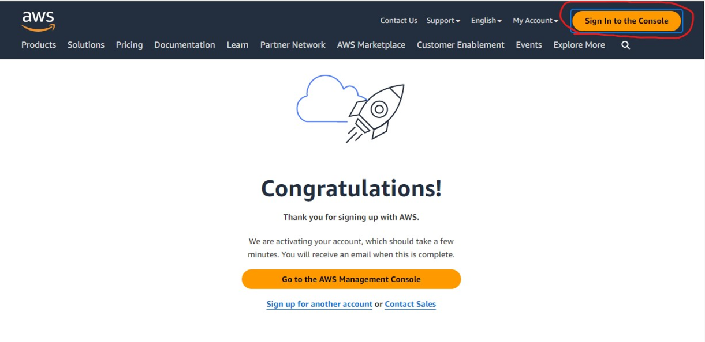

  * 

  
  * Screenshots of every step of signing into your AWS account

  
4 instructions on how to sign in to AWS as the root user

  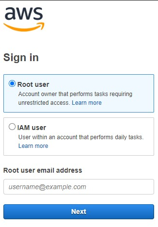
  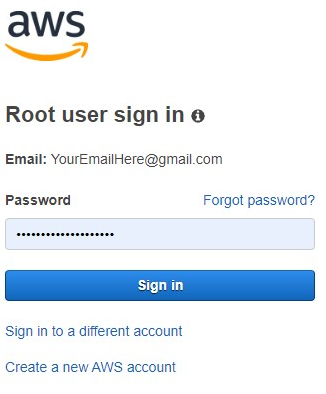
  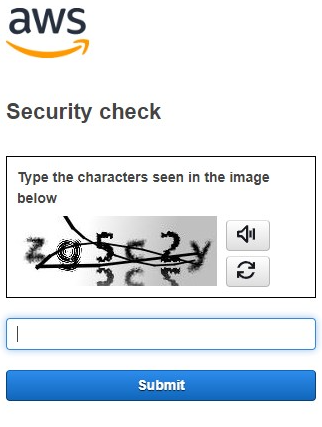
  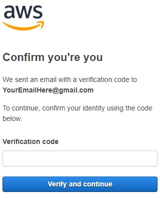

 

## Step 3: Create a new EC2 instance.
Create EC2:
* Scroll to the `Build a Solution` box and click "Launch a virtual machine With EC2"
  * 

Launch EC2:
* Click on the orange drop-box labeled: `Launch instance`
* This will open two options (`Launch instance`, and `Launch instance from template`) chose `Launch instance`

Configure:
* Give your EC2 instance a name
* In Quick Start, choose `Amazon Linux` OS Image and a `64-bit (x86)` architecture
 * It will have the following subtext `"""Amazon Linux 2023 AMI | ami-0578f2b35d0328762 (64-bit (x86), uefi-preferred) / ami - ..."""`
 * But the important thing is that it's "Free tier eligible" so you won't be charged no matter how many you have or how long you run them
* << Image >> 
* Launch

 

## Step 4: Run your code

 

 

 

Credits to [Hitch's](https://www.youtube.com/watch?v=xXirbnUB3NU&ab_channel=TechwithHitch) incredibly quick guide for setting up a free ec2 instance on aws which gave me this idea.
